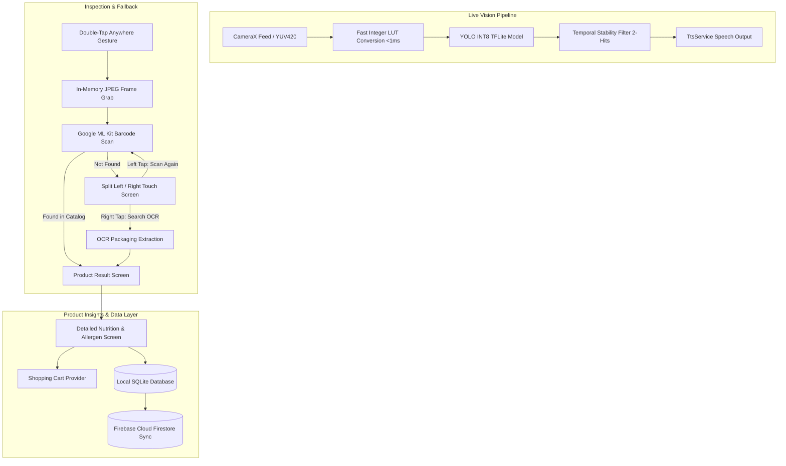

# 🛒 Grocery Vision

> **Empowering independent grocery shopping for visually impaired and low-vision individuals.**

**Grocery Vision** is an assistive mobile application built with **Flutter**, designed to give individuals with vision loss autonomy in grocery stores. The application combines **on-device real-time computer vision (YOLO INT8)**, **Google ML Kit barcode scanning**, and **packaging OCR text extraction** with an auditory-first, tactile-driven user interface conforming to WCAG AAA contrast standards.

---

## 📑 Table of Contents
- [Core Architecture & Technology Stack](#-core-architecture--technology-stack)
- [End-to-End Flow: "Life of a Scan"](#-end-to-end-flow-life-of-a-scan)
- [Key Features](#-key-features)
- [Accessibility & Sensory Design System](#-accessibility--sensory-design-system)
- [Technical Innovations & Optimizations](#-technical-innovations--optimizations)
- [Project Structure](#-project-structure)
- [Getting Started](#-getting-started)
- [Full Technical Manual](#-full-technical-manual)

---

## 🏛 Core Architecture & Technology Stack



### Technology Breakdown
- **Mobile Engine**: [Flutter](https://flutter.dev) (Dart 3.x), targeting Android (SDK 21–34) & iOS.
- **State Management**: [Riverpod](file:///c:/Users/varni/Desktop/grocery_vision/lib/main.dart) (`StateNotifierProvider`, `ChangeNotifierProvider`) for unidirectional reactive state flow.
- **On-Device Neural Network**: TensorFlow Lite running an INT8 quantized YOLO model ([weights_int8.tflite](file:///c:/Users/varni/Desktop/grocery_vision/assets/models/weights_int8.tflite)) via native C-FFI delegates in ~9.5 ms.
- **Barcode & Vision**: Google ML Kit Barcode Scanning backed by a local JSON catalog ([product_barcode_mapping.json](file:///c:/Users/varni/Desktop/grocery_vision/assets/data/product_barcode_mapping.json)).
- **Packaging OCR Extraction**: OCR extraction fallback to read product names, packaging text, brand, and ingredient labels.
- **Image Processing**: Custom [ImageConverter](file:///c:/Users/varni/Desktop/grocery_vision/lib/utils/image_converter.dart) with precomputed bit-shifted integer tables (`_vToR`, `_uToG`, `_vToG`, `_uToB`).
- **Data Persistence**: Offline-first SQLite database via [LocalHistoryService](file:///c:/Users/varni/Desktop/grocery_vision/lib/services/local_history_service.dart) with automatic cloud synchronization via [FirestoreService](file:///c:/Users/varni/Desktop/grocery_vision/lib/services/firestore_service.dart).
- **Sensory Output**: Singleton [TtsService](file:///c:/Users/varni/Desktop/grocery_vision/lib/services/tts_service.dart) for text-to-speech lifecycle control and [HapticService](file:///c:/Users/varni/Desktop/grocery_vision/lib/services/haptic_service.dart) for multi-pattern tactile feedback.

---

## 🔄 End-to-End Flow: "Life of a Scan"

```
[ User points camera at shelf ]
             │
             ▼
[ Real-time YOLO INT8 inference (~9.5 ms) ] ──► [ High-contrast bounding boxes rendered ]
             │                                              │
             ▼                                              ▼
[ 2-frame temporal confirmation ] ────────────► [ Haptic tick & Spoken announcement ]
             │
             ▼
[ User double-taps anywhere on screen ]
             │
             ▼
[ Zero-shutter-lag frame grabbed from RAM ]
             │
             ▼
[ Barcode scan performed via ML Kit ]
       ├───► Barcode matched ───────────────────────────────────┐
       │                                                        │
       └───► Barcode not found                                  │
                   │                                            │
                   ▼                                            │
             [ Split Left/Right UI & Audio Prompt ]             │
                   ├─── Left Half: Scan Barcode Again           │
                   └─── Right Half: Search Through OCR          │
                                   │                            │
                                   ▼                            ▼
                      [ OCR packaging extraction ] ───► [ Product Result Screen ]
                                                                │
                                                                ▼
                                                    [ Product Details Screen ]
                                                    - Nutritional breakdown
                                                    - Allergen warning badges
                                                    - Shelf life & storage tips
                                                    - Add to cart & SQLite history
```

1. **Continuous Real-Time Detection**: As the user points the phone at a grocery shelf, [YoloService](file:///c:/Users/varni/Desktop/grocery_vision/lib/services/yolo_service.dart) scans the video stream. When an item is confirmed across 2 consecutive frames with $>60\%$ confidence, its name is announced via [TtsService](file:///c:/Users/varni/Desktop/grocery_vision/lib/services/tts_service.dart) alongside a haptic tick.
2. **Periodic Guidance**: If the user drifts away from products for 4 seconds, a reminder sounds: *"Point camera at a grocery shelf"*.
3. **Zero-Precision Interaction**: The user double-taps anywhere on the screen. The app captures the live frame buffer directly from memory without triggering a hardware camera restart.
4. **Identification & Accessible Fallback**:
   - The frame is checked for standard retail barcodes.
   - If no barcode is detected, the screen divides into two tactile halves:
     - **Left Half**: *Scan Barcode Again*
     - **Right Half**: *Search Through OCR*
5. **Comprehensive Information Delivery**:
   - [ProductResultScreen](file:///c:/Users/varni/Desktop/grocery_vision/lib/features/scanner/screens/product_result_screen.dart) speaks the item's identity and estimated price.
   - [ProductDetailsScreen](file:///c:/Users/varni/Desktop/grocery_vision/lib/features/scanner/screens/product_details_screen.dart) provides spoken nutritional details, prominent allergen warning badges (Gluten, Dairy, Peanuts, Tree Nuts, Soy), shelf-life estimates, and optimal storage advice.

---

## ✨ Key Features

| Feature | Description | Key File |
| :--- | :--- | :--- |
| **Real-Time YOLO Scanner** | Live bounding box overlays and dynamic label cards with continuous voice guidance. | [scanner_screen.dart](file:///c:/Users/varni/Desktop/grocery_vision/lib/features/scanner/screens/scanner_screen.dart) |
| **Lighting Assistant** | Real-time scene exposure and glare detection with spoken alerts and one-tap torch toggle. | [lighting_helper_screen.dart](file:///c:/Users/varni/Desktop/grocery_vision/lib/features/scanner/screens/lighting_helper_screen.dart) |
| **Split-Screen Fallback** | Spatial binary decision layout (left vs. right half) matching voiceover instructions when barcodes are missing. | [scanner_screen.dart](file:///c:/Users/varni/Desktop/grocery_vision/lib/features/scanner/screens/scanner_screen.dart) |
| **Nutritional & Allergen Breakdown** | Comprehensive health details, allergen warning badges, and a read-aloud button for full ingredient narration. | [product_details_screen.dart](file:///c:/Users/varni/Desktop/grocery_vision/lib/features/scanner/screens/product_details_screen.dart) |
| **Smart Accessible Cart** | Quantity increment/decrement with spoken total recalculations, itemized list, and simulated checkout. | [cart_screen.dart](file:///c:/Users/varni/Desktop/grocery_vision/lib/features/cart/screens/cart_screen.dart) |
| **Offline Scan History** | Persistent SQLite logging of scanned items with automatic synchronization to Firebase Cloud Firestore. | [history_screen.dart](file:///c:/Users/varni/Desktop/grocery_vision/lib/features/history/screens/history_screen.dart) |
| **Audio & A11y Customization** | Adjustable TTS speech rate ($0.5\times$ to $2.0\times$), speech pitch controls, haptic modes, and high-contrast toggle. | [settings_screen.dart](file:///c:/Users/varni/Desktop/grocery_vision/lib/features/settings/screens/settings_screen.dart) |
| **Authentication & Profile** | Guest mode, email/password, and Google Sign-In with real-time personal shopping statistics. | [profile_screen.dart](file:///c:/Users/varni/Desktop/grocery_vision/lib/features/profile/screens/profile_screen.dart) |

---

## ♿ Accessibility & Sensory Design System

### Visual Theme & High Contrast ([AppTheme](file:///c:/Users/varni/Desktop/grocery_vision/lib/core/theme/app_theme.dart))
- **Abyss Navy Background (`#0A1929` / `#0A192F`)**: Maximizes OLED contrast and minimizes light emission to reduce eye strain.
- **Cyber Gold Primary Accent (`#FFBF00` / `#FFC107`)**: Provides a $>12:1$ contrast ratio against dark backgrounds, far surpassing WCAG AAA standards.
- **Surface Elevation Cards (`#112240` / `#1E293B`)**: Distinct card layers framed with prominent amber borders.

### Spatial Non-Visual Touch Ergonomics
- **No Precision Tapping**: The entire camera screen responds to a double-tap gesture.
- **Split-Screen Confirmation**: Fallback screens use two massive half-screen touch targets (left vs. right).
- **Minimum Target Sizes**: Interactive buttons maintain a height of 56–64dp minimum.

### Auditory Hierarchy & Speech Lifecycle
- **Centralized Singleton**: [TtsService](file:///c:/Users/varni/Desktop/grocery_vision/lib/services/tts_service.dart) manages speech across all routes.
- **Instant Cut-Off**: When changing tabs, dismissing dialogs, or tapping cancel, speech terminates immediately (`tts.stop()`), eliminating overlapping narration.
- **TalkBack & VoiceOver Compatibility**: Built with explicit `Semantics` labels and accessibility hints across all custom widgets.

---

## ⚡ Technical Innovations & Optimizations

1. **Sub-Millisecond Integer LUT YUV420 to RGB**:
   - Replaced floating-point conversion routines with precomputed bit-shifted integer lookup tables in [ImageConverter](file:///c:/Users/varni/Desktop/grocery_vision/lib/utils/image_converter.dart), slashing frame conversion from $\approx 60\text{ ms}$ to $< 1\text{ ms}$.
2. **Zero-Shutter-Lag In-Memory Frame Grabbing**:
   - Implemented [convertCameraImageToJpeg()](file:///c:/Users/varni/Desktop/grocery_vision/lib/utils/image_converter.dart) to capture frames straight from RAM, avoiding CameraX `takePicture()` session resets and hardware errors (`CameraDeviceImpl.onDeviceError`).
3. **Dynamic TFLite Tensor Reshaping**:
   - [YoloService](file:///c:/Users/varni/Desktop/grocery_vision/lib/services/yolo_service.dart) dynamically evaluates tensor shapes ($[1, 8, 2100]$ vs. $[1, 2100, 8]$) at initialization, guaranteeing compatibility with both YOLOv8 and YOLO11 INT8 models.
4. **Temporal Stability Filter**:
   - Requires 2 consecutive frames of identical class detections before audio narration triggers, eliminating bounding-box flicker and false-positive announcements.
5. **Speech Lifecycle Management**:
   - Audio is tied to screen lifecycles, immediately halting speech upon route pop or tab change to prevent desynchronized narration.

---

## 📁 Project Structure

```
grocery_vision/
├── assets/
│   ├── data/
│   │   └── product_barcode_mapping.json     # Local catalog mapping barcodes to products
│   └── models/
│       ├── weights_int8.tflite              # 8-class INT8 quantized YOLO model (~2.8 MB)
│       ├── best_int8.tflite                 # Backup checkpoint model
│       ├── labels.txt                       # Target grocery class labels
│       └── data.yaml                        # Roboflow training configuration
├── lib/
│   ├── core/theme/                          # WCAG AAA high-contrast navy & gold design system
│   ├── features/
│   │   ├── auth/                            # Login, signup, password reset, guest entry
│   │   ├── cart/                            # Shopping cart state, checkout simulation, quantity
│   │   ├── dashboard/                       # Bottom navigation bar shell and dashboard
│   │   ├── history/                         # Audit logs of past scans with category filters
│   │   ├── onboarding/                      # Accessible walkthrough and camera permissions
│   │   ├── profile/                         # User profile and shopping metrics
│   │   ├── scanner/                         # Live YOLO preview, lighting helper, product results
│   │   └── settings/                        # TTS rate/pitch sliders, haptics, about info
│   ├── models/                              # ProductModel, CartItem, YoloDetection
│   ├── services/
│   │   ├── barcode_service.dart             # Google ML Kit barcode processor
│   │   ├── barcode_product_repository.dart  # Local catalog resolver
│   │   ├── firestore_service.dart           # Two-way Firebase Cloud Firestore sync
│   │   ├── haptic_service.dart              # Multi-pattern tactile feedback engine
│   │   ├── local_history_service.dart       # SQLite offline persistence
│   │   ├── tts_service.dart                 # Centralized text-to-speech singleton
│   │   └── yolo_service.dart                # TFLite inference engine & temporal filter
│   ├── utils/
│   │   └── image_converter.dart             # Bit-shifted integer LUT YUV420 to RGB & JPEG encoder
│   ├── firebase_options.dart                # Firebase configuration
│   └── main.dart                            # Application entry point with Riverpod ProviderScope
├── test/                                    # Unit tests validating models, LUTs, and repositories
└── pubspec.yaml                             # Flutter dependencies and assets declaration
```

---

## 🚀 Getting Started

### Prerequisites
- [Flutter SDK](https://docs.flutter.dev/get-started/install) (version 3.19.0 or higher)
- Android SDK 21+ or iOS 13+ device/emulator (a physical device with a camera is recommended for live computer vision testing)

### Installation
```bash
# 1. Clone the repository
git clone https://github.com/varnitp101/grocery_vision.git
cd grocery_vision

# 2. Install dependencies
flutter pub get

# 3. Verify static analysis and tests
flutter analyze
flutter test

# 4. Run the application
flutter run
```

---

